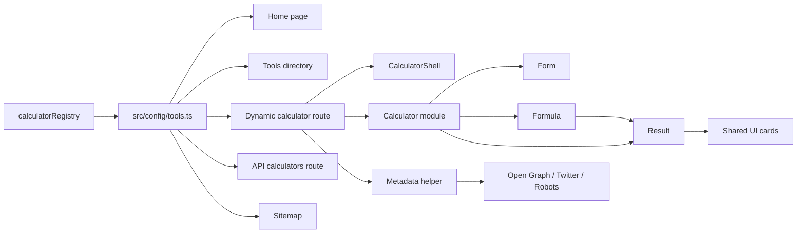

# Data Flow

This document describes how data moves through NobleCalculator today.

## 1. Source of truth

The calculator registry in `src/features/calculators/shared/calculator-registry.ts` is the primary source of truth.

It stores:
- `slug`
- `title`
- `description`

That registry is re-exported through `src/config/tools.ts` so the app, sitemap, API route, and directory pages all read the same data.

Reusable calculator math is being moved into `packages/calculators-core`, and shared number formatting now lives in `packages/shared-format`.

## 2. Page routes

### Home page

`src/app/page.tsx` is a landing page.

It links to the directory and a few featured tools, but it does not own calculator logic.

### Tools directory

`src/app/tools/page.tsx` reads the shared registry and renders the full tool list.

Each card links to a dedicated route.

### Calculator route

`src/app/tools/[slug]/page.tsx` resolves the current slug, finds the matching calculator definition, and renders the right calculator component.

That route also generates page metadata from the same registry entry.

## 3. Calculator module flow

Each calculator follows the same pattern:

1. `schema.ts` defines input and output types.
2. `formula.ts` contains pure calculation logic.
3. `form.tsx` renders the user inputs.
4. `result.tsx` renders formatted outputs.
5. `calculator.tsx` connects form state to the formula and result view.
6. `index.ts` re-exports the public module API.

That structure keeps business logic separate from UI.

In the new monorepo layout, the pure calculation pieces are the first candidates for shared packages, while the route-specific UI stays in the web app.

## 4. Shared UI flow

Shared components live in `src/components/shared/`.

They provide:
- `AppHeader`
- `AppFooter`
- `CalculatorShell`
- `ToolCard`
- `ResultCard`

These components make the app consistent while allowing each calculator to keep its own logic.

## 5. API flow

`src/app/api/calculators/route.ts` returns the same registry data used by the pages.

This avoids duplicate JSON fixtures and keeps the API aligned with the UI.

## 6. SEO flow

Metadata is centralized in `src/lib/metadata.ts`.

The app uses:
- `metadata` in the root layout
- `createPageMetadata()` for page-specific metadata
- `src/app/sitemap.ts` for crawl discovery
- `src/app/robots.ts` for indexing rules
- `public/og-image.svg` for social previews

## 7. Integration flow

`src/features/integrations/*` currently contains planned connectors for QuickBooks, Wise, and Xero.

They are placeholders for future export, sync, and payout workflows.

## 8. Why this flow works

This structure keeps the app:
- easy to extend
- easy to test
- SEO-friendly
- simple to maintain

When a new calculator is added, you usually only need to:
- add one registry entry
- add one calculator module
- let the route and sitemap pick it up automatically